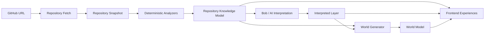

# CodeBiome — Technical Architecture (Step 2: Technical Foundation)

Status: **revised after an infrastructure review for a 48-hour hackathon
build targeting Vercel's free tier.** See
[`ARCHITECTURE_DECISIONS.md`](./ARCHITECTURE_DECISIONS.md) for the full
reasoning behind every change in this revision — in short, Postgres, Prisma,
and Inngest were all deferred (not required for the first vertical slice),
and PixiJS was replaced with React Three Fiber. The scaffolded project in the
repository root implements the v1 slice this document describes.

Repository state at the time of the original proposal: empty except
`PRODUCT_SPEC.md` — no existing code, framework, or configuration to
preserve. The stack below is a fresh recommendation, not a migration.

## 1. Guiding separation of concerns

Everything in this architecture exists to keep five layers strictly separated,
per the product spec:

| Layer | Responsibility | Can it "invent" facts? |
|---|---|---|
| 1. Deterministic repository facts | Parsing, static analysis, git log, dependency graphs | No — ground truth only |
| 2. AI / Bob interpretation | Explanations, narrative, journeys, missions, domain concepts | Yes, but only *about* facts it's given, never fabricating new facts |
| 3. Repository Knowledge Model (RKM) | Canonical structured record combining 1 + 2, with provenance | N/A — it's the contract |
| 4. World representation | Deterministic mapping of the RKM into world entities (biomes, regions, landmarks, paths) | No — pure function of the RKM |
| 5. User-facing experiences | Rendering, HUD, journey UI, missions UI, chat | No — pure consumer of layers 3 & 4 |

The single most important rule: **layers 4 and 5 never read raw repository
data directly.** They only ever consume the Repository Knowledge Model. This
is what keeps the world "a visualization of repository intelligence, not a
separate source of truth" (per spec).

See [`REPOSITORY_KNOWLEDGE_MODEL.md`](./REPOSITORY_KNOWLEDGE_MODEL.md) for the
schema that formalizes layer 3, and [`ANALYZER_ARCHITECTURE.md`](./ANALYZER_ARCHITECTURE.md)
for how layer 1 is produced.

## 2. Chosen stack and rationale

**v1 (implemented, hackathon slice)** — minimum moving parts to get
GitHub URL → analysis → Knowledge Model → World Model → visualization working
end to end on Vercel's free tier:

| Concern | Choice | Why |
|---|---|---|
| Framework | **Next.js 14+ (App Router)**, TypeScript | One deployable unit on Vercel; a single Route Handler is the entire backend for v1 — fits "modular monolith" directive with the least ceremony |
| UI rendering (2D/2.5D world) | **React Three Fiber** (Three.js) + `@react-three/drei` | Cinematic look (lighting, fog, emissive glow) achievable from primitive geometry with no art assets — see `ARCHITECTURE_DECISIONS.md` §4 for the full comparison against PixiJS/Canvas/CSS. Isolated to one file (`src/world-engine/WorldView.tsx`) behind the `WorldModel` type as the swap seam |
| Styling | Tailwind CSS | Fast iteration on HUD/panels |
| Client state | Plain React state (`useState`) | One request/response per analysis; no caching/revalidation logic to justify TanStack Query yet |
| Repository ingestion | GitHub REST API + tarball download (`codeload.github.com`) + `tar` (npm) for extraction | No `git` binary dependency, no full clone; runs inside a single Node.js Route Handler invocation within Vercel's function limits |
| Analysis execution | **Synchronous**, in the same request that receives the GitHub URL | Repo size is capped (≤600 files scanned) specifically so this fits comfortably under Vercel's function duration/memory limits — no background job system needed for this slice |
| Persistence | **None** — Knowledge Model + World Model returned as JSON, held in client React state for the session; a `KnowledgeModelStore` interface (in-memory impl) is the seam for adding Postgres later | See `ARCHITECTURE_DECISIONS.md` §3 for the evidence-based reasoning |
| Validation | **Zod** | Schema-validates the Knowledge Model and World Model at construction time; this is the actual mechanism (not just convention) behind "the model can't silently drift from its documented shape," and will be the same mechanism used to stop Bob from inventing facts once it's added |

**Deferred (documented, not yet implemented)** — see
`ARCHITECTURE_DECISIONS.md` for exactly when each becomes REQUIRED:

| Concern | Later choice | Trigger to add it |
|---|---|---|
| Database | Postgres (Neon or Vercel Postgres) via Prisma | Multi-session mission/journey progress, shared world links, cross-user caching, auth |
| Background jobs | Inngest (or Trigger.dev) | Repo-size caps are lifted, or an analyzer genuinely needs a full git clone / multi-step retryable execution |
| Object/blob storage | Vercel Blob | Snapshot caching across requests becomes worth it (currently extract-then-delete per request) |
| Client server-state | TanStack Query | Real caching/revalidation needs appear (e.g. re-checking a repo for new commits) |
| Client UI state | Zustand | World-engine interaction state outgrows component-local `useState` |
| AI provider | Anthropic Claude via the Messages API, behind a `BobClient` interface | Step 3: Bob interpretation (explanations, journey, missions) — not part of this vertical slice |

This is deliberately **one Next.js application**, not a split frontend/backend
repo — the "modular monolith" directive is satisfied via strict internal
module boundaries (§4), not process/service boundaries.

## 3. High-level pipeline



Deterministic vs. AI-generated, concretely:

**Deterministic (layer 1 — analyzers, §see ANALYZER_ARCHITECTURE.md):**
- File tree, file sizes, languages, per-file complexity metrics
- Import/require/module graph → dependency edges
- Framework/entry-point detection via known file/manifest patterns (e.g.
  `package.json#main`, `pages/`/`app/` routes, `bin` scripts, Dockerfile
  `ENTRYPOINT`)
- Git log statistics: commit frequency, contributors, recently changed files,
  co-change hotspots
- Test file detection (naming/location heuristics) and which modules they
  reference
- TODO/FIXME occurrences, duplicated-code candidates (similarity hashing),
  dead/unreferenced export candidates (reachability analysis)
- Documentation presence: README existence, doc-comment coverage %, docs/ folder contents
- Security indicators: **only** from evidence — dependency advisory database
  matches (e.g. `npm audit`/OSV data), static pattern rules (hardcoded
  secret-shaped strings, known-unsafe API calls). No LLM judgment calls here.

**AI-interpreted (layer 2 — Bob, reads the RKM only):**
- Natural-language explanations of a module/file/data flow
- Naming and describing domain concepts (e.g. "this is the Billing domain")
- Onboarding journey narrative and step ordering
- Mission descriptions/flavor text and suggested "first contribution" picks
- Answers to "explain this / trace this / what would break?" — grounded in
  and citing RKM entity IDs, never inventing new files/modules/edges
- Risk *narrative* framing on top of deterministic risk indicators (Bob may
  say "this hotspot is risky because X, Y, Z" where X/Y/Z are RKM facts, but
  may not introduce a new indicator that isn't already in the RKM)

Every Bob output is Zod-validated against a schema that only allows references
to existing RKM entity IDs and a small set of enums — this is the technical
enforcement of "the AI must not invent repository facts."

## 4. Backend architecture (modular monolith)

This is the target module shape. **v1 implements a reduced subset directly**:
`ingestion/` (GitHub tarball fetch + snapshot), `analyzers/` (`structure` and
`dependency` only — see `ANALYZER_ARCHITECTURE.md` for the full planned set),
`knowledge-model/` (`builder.ts` + a `store.ts` in-memory cache instead of a
Prisma-backed `repository.ts`), and `world/` (`builder.ts`). There is no
`ai/` module yet and no `jobs/` module — the pipeline runs directly inside
the single `api/analyze` Route Handler. See `ARCHITECTURE_DECISIONS.md` for
why, and what triggers building out the rest of this tree.

```
src/server/
  modules/
    ingestion/          # GitHubClient, RepositoryFetcher, SnapshotBuilder
    analyzers/           # Analyzer interface + registry + individual analyzers
      structure/
      dependency/
      git-history/
      code-health/
      security/
      tests/
      documentation/
    knowledge-model/     # Aggregates analyzer outputs -> RepositoryKnowledgeModel
      builder.ts
      repository.ts       # persistence (Prisma-backed)
      validation.ts       # Zod schemas
    ai/                   # "Bob"
      client.ts            # BobClient interface + Anthropic implementation
      prompts/
      services/
        explain.ts
        journey.ts
        missions.ts
        domain-concepts.ts
      interpreted-layer.ts # persistence + validation
    world/
      builder.ts           # pure fn: (RKM, InterpretedLayer) -> WorldModel
      mappings/            # entity-type -> world-entity-type rules
    jobs/
      pipeline.ts           # Inngest function: orchestrates the full pipeline
      status.ts             # job status store/polling API
  api/                    # Next.js Route Handlers — thin controllers only
    repositories/
    jobs/
    world/
    bob/
```

Rules enforced (via code review + an import-boundary lint rule, e.g.
`eslint-plugin-boundaries`):
- `world/` may import from `knowledge-model/` and `ai/` types only — never
  from `ingestion/` or `analyzers/` directly.
- `ai/` may import from `knowledge-model/` types only — never from
  `analyzers/` or raw snapshot data.
- `api/` route handlers contain no business logic — they call into a module
  and serialize the result.
- Analyzers never call each other directly; shared inputs flow through the
  `AnalyzerContext` (see ANALYZER_ARCHITECTURE.md).

Persistence (Prisma, sketch — **deferred, see `ARCHITECTURE_DECISIONS.md` §3**):
- `Repository` (owner, name, url, defaultBranch)
- `Snapshot` (repositoryId, commitSha, blobStorageKey, fetchedAt)
- `AnalysisJob` (repositoryId, snapshotId, status, step, error, timestamps)
- `KnowledgeModel` (snapshotId, json, schemaVersion)
- `InterpretedLayer` (knowledgeModelId, json, schemaVersion, bobModelVersion)
- `WorldModel` (knowledgeModelId, json, schemaVersion)

Knowledge Models are cached per `(repository, commitSha)`. A re-visit of an
already-analyzed commit is a cache hit; a new commit invalidates and
re-triggers the pipeline. **v1** implements this caching contract via a
`KnowledgeModelStore` interface (`src/server/knowledge-model/store.ts`) with
an in-memory implementation — swapping in the Prisma-backed version above
later means implementing the same two-method interface, not changing any
caller.

> **Correction (post-investigation):** the `ai/` module sketched above
> ("BobClient interface + Anthropic implementation") assumed CodeBiome would
> call out to a hosted "Bob" model. Investigating IBM Bob 2.0's actual
> integration mechanism (documented in
> [`BOB_INTEGRATION.md`](./BOB_INTEGRATION.md)) found this direction is
> backwards: **IBM Bob is an MCP client that calls INTO CodeBiome**, not a
> service CodeBiome calls. The real implementation is
> `src/server/bob-tools/` (tool implementations) + `src/app/api/mcp/route.ts`
> (the MCP server Bob connects to) — see that document for the full
> architecture. `src/types/bob.ts`'s `BobClient` interface is kept exactly
> as originally built (an honest "not connected" seam for a possible future
> direct-call integration) but is *not* where the real integration lives.

## 5. Frontend architecture

Target shape (v1's actual scaffold is the reduced version noted below each
line):

```
src/
  app/
    page.tsx                        # URL input + world view combined for v1
    repo/[owner]/[name]/            # (not yet split into its own route — v1 is a single page)
      page.tsx                      # World view (guided + free explore)
      journey/page.tsx              # Guided journey stepper (not yet built)
  world-engine/                     # v1: WorldView.tsx — a React Three Fiber component
    scene/                          # (future) split out as the scene grows past one component
    interaction/                    # picking/selection currently inline in WorldView's onClick
  features/
    world-hud/                      # (not yet built)
    investigation-panels/           # v1: entity-panel/EntityPanel.tsx (module facts only)
    guided-journey/                 # (not yet built)
    free-exploration/               # v1: OrbitControls is the entirety of this today
    missions/                       # (not yet built)
    bob-chat/                       # (not yet built — no Bob/AI layer in v1)
  components/                       # v1: RepoForm.tsx
  lib/
    parseGitHubUrl.ts               # v1's only lib helper; api-client/ layer not needed yet (one fetch call)
```

Key decisions:
- **v1's world renderer is a React component (`WorldView.tsx`), not a
  framework-agnostic engine with an imperative bridge.** React Three Fiber is
  React-first, so the natural seam is "one component owns all `three`/`@react-three`
  imports and takes `(worldModel, selectedWorldId, onSelect)` as props" —
  see `ARCHITECTURE_DECISIONS.md` §4. If the world later needs an
  engine that isn't React-native (e.g. PixiJS for a dense tile world), the
  imperative-engine-plus-adapter pattern described in the original proposal
  is the right shape to fall back to; it just isn't justified yet.
- **Investigation panels, journey, missions, and Bob chat are all just
  consumers of the same two data sources**: the Knowledge Model and world
  selection events. None of them hold their own copy of repository truth.
  v1 only implements the investigation panel (module facts on selection).
- **Guided Journey vs Free Exploration** are modes of the same world view,
  not different pages — not yet relevant in v1, which has no journey (no Bob
  layer yet) and only free exploration (`OrbitControls`).
- Bob chat sends the currently-focused entity ID as context so answers are
  grounded ("explain this" = "explain entity X") — deferred along with the
  rest of the AI layer.

## 6. Analyzer architecture

See dedicated document: [`ANALYZER_ARCHITECTURE.md`](./ANALYZER_ARCHITECTURE.md).
Summary: analyzers are independent, versioned plugins implementing a common
`Analyzer<T>` interface, run by a topologically-sorted pipeline over a
`RepositorySnapshot`, each producing a validated `AnalyzerResult<T>` that the
Knowledge Model builder aggregates.

## 7. Vercel deployment constraints and mitigations

**v1, as implemented:**
- The analysis pipeline runs **synchronously inside the `POST /api/analyze`
  Route Handler**, on the Node.js runtime (`export const runtime = "nodejs"`,
  required for filesystem/`tar` access — the Edge runtime cannot do this).
  `maxDuration` is set to 60s; verify this figure against your current Vercel
  plan before relying on it, since these limits change over time.
- No `git` binary/clone: ingestion downloads a single tarball from
  `codeload.github.com` and extracts it into `/tmp` (`snapshotBuilder.ts`),
  which is deleted again in a `finally` block once analysis finishes reading
  from it — `/tmp` is ephemeral and invocation-scoped, so nothing relies on
  it surviving between requests.
- Repo size/memory are bounded deliberately: at most 600 files are walked,
  and any single file over 200KB is not read for content-based analysis
  (still counted for size stats). This keeps a single invocation well inside
  Hobby-tier memory limits regardless of the target repo's actual size.
- No caching layer beyond an in-memory `Map` scoped to a warm lambda
  instance (`InMemoryKnowledgeModelStore`) — acceptable for a demo, and
  explicitly not relied upon for correctness (a cold instance just
  re-analyzes).
- Streaming (SSE progress updates during analysis) was considered and
  deferred — v1 shows a single loading state for the one request/response
  cycle; worth adding before a real demo if analysis feels slow on stage.

**What would force background processing (Inngest) later:** dropping the
file-count/size caps to support arbitrarily large repositories, needing a
real `git clone` for deep history, or needing retryable multi-step execution.
None of those apply to the capped, tarball-only v1 pipeline. See
`ARCHITECTURE_DECISIONS.md` §2 for the full reasoning.

## 8. Explicit non-goals for this step

Not designed/built yet (intentionally deferred): authentication/accounts,
multiplayer/shared worlds, billing, private-repo support, real-time
collaboration, the Bob/AI interpretation layer (explanations, journey,
missions), most of the planned analyzers (git history, code health beyond
large-files, security, tests, documentation beyond README detection), and
the full cinematic world (fog/particles/lighting variety, more than a
handful of visible entities). This step establishes the architecture, the
Repository Knowledge Model contract, and a working end-to-end vertical slice
to build the rest on top of.
